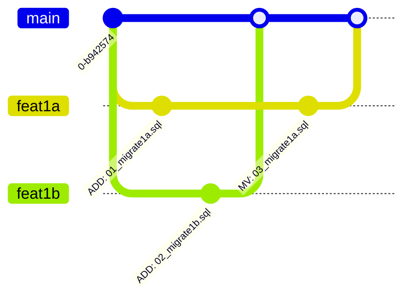

# SANDBOX

## 困りごと

- [node-pg-migrate](https://github.com/salsita/node-pg-migrate) はマイグレーションをファイル名のタイムスタンプ順に実行する
- 実行済みのマイグレーションより古いタイムスタンプで新規にマイグレーションが作成されると実行に失敗する (この挙動はオプションでオミットはできるが)
- PRマージ後にデプロイする場合
    1. 複数のPRでマイグレーションを作成
    2. マージ順によりマージ後のマイグレーションが失敗する
    3. 失敗した場合はリカバリが必要

## 対策

1. PRのチェックでベースブランチ->マージ後のブランチでマイグレーションを逐次実行し成功するか確認
2. PRでマイグレーションの変更がされている場合はPRにマイグレーションある旨ラベル付け
3. マイグレーションが含まれるPRマージ後に下記条件にあてはまるPRにコメント投げ、ベースブランチをマージしてチェックを再度実行するよううながす
    - オープン状態である
    - マイグレーションある旨ラベル付けされている
    - 同一ベースブランチである

## チェックしないこと

- マイグレーションの改変・削除

## テスト

### 機能ブランチ間

- [Test1 - a](https://github.com/ysuzuki-bysystems/test-for-migration-integration/pull/4)
- [Test1 - b](https://github.com/ysuzuki-bysystems/test-for-migration-integration/pull/5)
